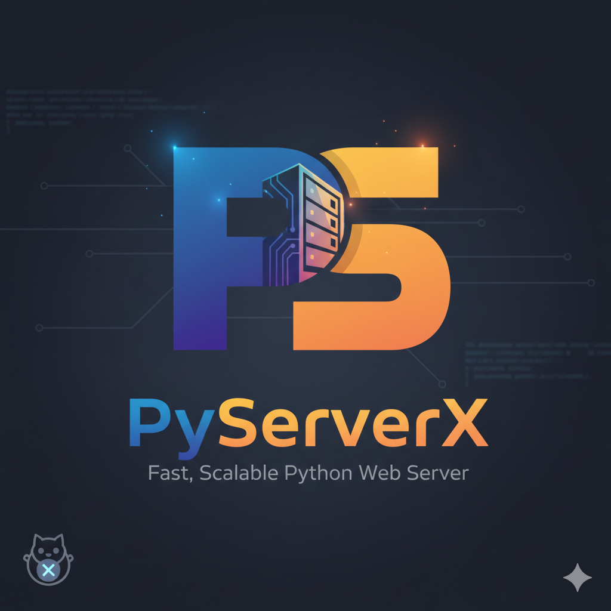

<div align="center">
  <h1>🚀 PyServerX</h1>
  <p>
    <strong>A lightweight, customizable Python HTTP server with modular request handlers and static file serving.</strong>
  </p>
  
</div>

---

## 🌟 Features
- Modular request handlers for GET, POST, PUT, PATCH, DELETE
- Serve static files (HTML, JSON, images)
- Easy configuration via `config.py`
- Utility functions for file and response management
- Simple, extensible codebase for learning or production use

---

## 📁 Project Structure
```
Http_Server/
├── config.py                # Server configuration
├── server.py                # Main server logic
├── handlers/                # Request handlers (CRUD)
│   ├── get_handler.py
│   ├── post_handler.py
│   ├── put_handler.py
│   ├── patch_handler.py
│   └── delete_handler.py
├── static/                  # Static files (HTML, JSON, images)
│   ├── index.html
│   ├── form.html
│   ├── guide.json
│   ├── memories.json
│   └── sample.png
├── utils/                   # Utility modules
│   ├── file_utils.py
│   └── response_utils.py
└── requirements.txt         # Python dependencies
```

---

## 🚦 Quick Start
1. **Clone the repo**
   ```sh
   git clone https://github.com/Ada890/PyServerX.git
   ```
2. **Install dependencies**
   ```sh
   pip install -r requirements.txt
   ```
3. **Run the server**
   ```sh
   python server.py
   ```
4. **Access the server**
   - Open your browser and go to `http://localhost:<port>` (see `config.py` for port)

---

## 🛠️ Customization
- Add or modify handlers in `handlers/` for custom logic
- Update `config.py` for server settings
- Place additional static files in `static/`

---

## 📚 Example Endpoints & Usage

### GET Example
```http
GET /static/index.html HTTP/1.1
Host: localhost:8080
```
Response:
```html
<!DOCTYPE html>
<html>
   <head><title>Index</title></head>
   <body>Welcome to PyServerX!</body>
</html>
```

### POST Example
```http
POST /api/data HTTP/1.1
Host: localhost:8080
Content-Type: application/json

{
   "name": "Dino@rmy",
   "message": "Hello, server!"
}
```
Response:
```json
{
   "status": "success",
   "data": {
      "name": "Dino@rmy",
      "message": "Hello, server!"
   }
}
```

### PATCH Example
```http
PATCH /api/resource/123 HTTP/1.1
Host: localhost:8080
Content-Type: application/json

{
   "message": "Updated message"
}
```
Response:
```json
{
   "status": "updated",
   "id": 123,
   "message": "Updated message"
}
```

### PUT Example
```http
PUT /api/resource/123 HTTP/1.1
Host: localhost:8080
Content-Type: application/json

{
   "name": "Dino@rmy",
   "message": "Replaced message"
}
```
Response:
```json
{
   "status": "replaced",
   "id": 123,
   "data": {
      "name": "Dino@rmy",
      "message": "Replaced message"
   }
}
```

### DELETE Example
```http
DELETE /api/resource/123 HTTP/1.1
Host: localhost:8080
```
Response:
```json
{
   "status": "deleted",
   "id": 123
}
```

---

## 💡 Inspiration
Built for learning, rapid prototyping, and as a foundation for more advanced Python web servers.
